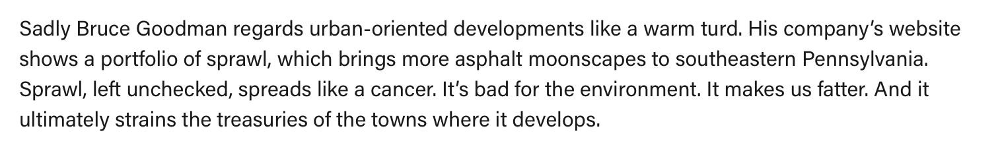

```{r setup, include=FALSE}
knitr::opts_chunk$set(echo = FALSE, dpi = 400)
```

```{r libraries, include=FALSE}
library(ggplot2)
library(cowplot)
library(ggmap)
library(ggimage)
library(dplyr)
```

## A new Wawa in the neighborhood!

Goodman Properties is planning a Wawa with gas (“Super Wawa”) at the corner of Easton Road and Waverly Road in Glenside, PA. Read about it on the Cheltenham Township [website](https://cheltenhamtownship.org/pview.aspx?id=40801)

Concerns from neighbors and the community were raised about safety, traffic, and the juxtaposition with smaller scale properties and businesses in the area

This is what one neighbor had to say on a local [website](https://glensidelocal.com/commentary-here-comes-wawa-there-goes-the-neighborhood/?):

```{r}

```


## Is this new Wawa unusual?

- Are other Super Wawa locations in similar areas?
- Are other Super Wawa locations this close to other Wawas?

## Step 1: Query data on Wawa locations in Northeast

Retrieved the Wawa locations from wawa.com for the area around Glenside, PA. 

*Retrieved data on 485 unique Wawa locations (PA, NJ, DE, MD).*

Wawa.com data does not include detailed information on location size, number of pumps, etc.

* 470/485 Wawa locations are open 24 hours
* 280/485 Wawa locations have gas
* 280/485 Wawa locations have restrooms


```{r}
# Load in data previously generated by '01_wawadata.R', '03_osmdata.R'
wawa_df <- readRDS('../data/wawa_df.Rds')
osm_df <- readRDS('../data/osm_df.Rds')

# For better labels
wawa_df$gas_label <- dplyr::if_else(wawa_df$fuel==TRUE, "Gas","No Gas")
# Have col names lat state city in both
wawa_osm <- cbind(rename(wawa_df, lat_wawa = lat, lon_wawa = long, state_ab = state), 
                  rename(osm_df, osm_city = city))

wawa_osm$maxspeed_num <- as.numeric(gsub(" mph","",wawa_osm$maxspeed))
wawa_osm$lanes_num <- as.numeric(wawa_osm$lanes)
```

## How to get Wawa locations off the internet {.smaller}

```{r echo=TRUE, eval=FALSE}
library(httr)
library(jsonlite)

# Build urls for grid of lat/long around PHL ----
lats <- c(39.9526 - seq(0.1,0.6,0.2) ,39.9526 + seq(0,0.6,0.2) )
longs <- c(-75.1652 - seq(0.1,0.6,0.2), -75.1652 + seq(0,0.6,0.2))
all_combs <- tidyr::crossing(lats, longs)
urls <- paste0('https://www.wawa.com/Handlers/LocationByLatLong.ashx?limit=50&lat=',
               all_combs$lats, '&long=',all_combs$longs)

# Create a list of results using GET ----
raw_results_wawa <- lapply(urls, GET)
# Convert returned json to a data.frame ----
jsonRespTexts <- lapply(raw_results_wawa, function(rr) content(rr, as="text") )
res_list_wawa <- lapply(jsonRespTexts, fromJSON)
res_list_wawa <- lapply(res_list_wawa, function(rr) rr$locations) 
# Do some additional cleaning... not shown
```

## TThe resulting data {.smaller}

```{r}
print_wawa <- head(wawa_df)
rownames(print_wawa) <- NULL
pander::pander(print_wawa[,1:26])
```

## Here is a map of all the locations in the dataset

```{r warning=FALSE}

mapdf <- wawa_df[,c("long","lat")]
mapdf$new <- c(rep("exists",nrow(wawa_df)-1),"new")

# getting the map
mapgilbert <- get_map(location = c(lon = mean(mapdf$long), lat = mean(mapdf$lat)), zoom = 8,
                      maptype = "hybrid", scale = 2)

# plotting the map with some points on it
ggmap(mapgilbert) +
  geom_point(data = mapdf, aes(x = long, y = lat, fill = new, alpha = 0.9), size = 2, shape = 21) +
  guides(fill=FALSE, alpha=FALSE, size=FALSE)

```


## Proposed new Wawa site
The proposed Wawa is at [200 S Easton Rd.](https://www.google.com/maps/place/200+S+Easton+Rd,+Glenside,+PA+19038/@40.0986321,-75.1580774,17z/data=!3m1!4b1!4m5!3m4!1s0x89c6ba0ab50e862d:0xda87770daaf8ea23!8m2!3d40.098628!4d-75.1558834)

```{r warning=FALSE}
# ZOOM in on new wawa
new_wawa <- data.frame(long = c(-75.155848, -75.155848-0.005, -75.155848+0.005),
                       lat = c(40.098564, 40.098564-0.005, 40.098564+0.005))
map_new <- get_map(location = c(lon = new_wawa$long[1], lat = new_wawa$lat[2]), zoom = 15,
                      maptype = "hybrid", scale = 2)

# plotting the map with some points on it
ggmap(map_new) +
  geom_point(data = new_wawa, aes(x = long, y = lat, fill = "red", alpha = 0.9), size = 2, shape = 21) +
  guides(fill=FALSE, alpha=FALSE, size=FALSE) + 
  scale_y_continuous(limits = c(40.098564-0.005, 40.098564+0.005)) +
  scale_x_continuous(limits = c(-75.155848-0.005, -75.155848+0.005)) +
  NULL

```

## Step 2: Annotate Wawa locations with data from OpenStreetMaps

<font size="2">
- Calculate the distance to the nearest Wawa for each location

- Retrieve number of lanes and max speed limit of road 
  + May be misleading because nearest road might be a driveway or side road off of a major highway
  + Lanes and max speed limit are not available for most Wawa coordinates

- Count the number of houses, highways, and sidewalks in a set area around Wawa location
  + Not all buildings are on openstreetmaps - we need a better data source
  + Considered 'highway=motorways' as highways (https://wiki.openstreetmap.org/wiki/Key:highway)
  + Considered 'footway=sidewalk' as sidewalks

*These results could be sensitive to the size of the area selected. Here I used a 0.01 degree latitude and longitude rectangle centered around the location. This is approximately a 0.69 x 0.53 mile rectangle.*
</font>

## Results: The new Wawa will be unusually close to another Wawa location

The distance to the nearest Wawa from each Wawa location was calculated in meters. The shortest distance between the Wawa coordinates was calculated according to the 'Vincenty (ellipsoid)' method as implemented in the 'geosphere' R package.

```{r}
new_dist <- wawa_df$min_dist_wawa[wawa_df$storeName=="NEW"]
```

The closest Wawa to the proposed location will be `r new_dist` meters from the nearest Wawa. That is `r round(new_dist/1609.34,3)` miles.

The median distance between locations is `r round(median(wawa_df$min_dist_wawa[-486]),3)` meters.

```{r}
sandwich_file = '~/Documents/wawa/hoagiepic.jpg'
# Image Source: https://www.phillymag.com/foobooz/2017/04/03/wawa-hoagie-decline/
img <- magick::image_read(sandwich_file)
```

```{r}
dist_p <- wawa_df %>% filter(state %in% c("NJ","PA")) %>% 
  ggplot(aes(x=gas_label, y=min_dist_wawa/1609.34)) + 
  geom_hline(yintercept = new_dist/1609.34, color="red", linetype = 2) + 
  # geom_boxplot(outlier.shape = NA) + geom_jitter(height = 0, width = 0.2, alpha=0.5) + 
  geom_text(y=0.55, x=1, label = "Proposed Wawa", size=3, color="red") + 
  ggbeeswarm::geom_quasirandom() + 
  facet_wrap(~state) +
  ylim(c(0,10)) +
  labs(title = "Distance to nearest Wawa", 
       # subtitle = "Dotted red line shows proposed Wawa,\nsplit by state",
       y="Distance (miles)", x="")+
  theme_minimal()+ 
  theme(text = element_text(size=18))

ggdraw() + 
  draw_image(img, scale = 0.75) +
  draw_plot(dist_p)
```

## Continued

```{r}
## ggimage
median_min_dist <- wawa_df %>% filter(state %in% c("NJ","PA")) %>% 
  group_by(state, gas_label) %>% 
  summarise(min_dist_miles = median(min_dist_wawa/1609.34))

median_min_dist$label <- c("Proposed Wawa", NA, NA, NA)

logo_file = '../data/195309-200.png'
# Image source: Sandwich by Chris Markhing from the Noun Project

ggplot(median_min_dist, aes(x=gas_label, y=min_dist_miles)) + 
  geom_image(image=logo_file, size = .2)+
  geom_hline(yintercept = new_dist/1609.34, color="red", linetype = 2) + 
  geom_text(y=0.75, aes(label = label), size=3) + 
  facet_wrap(~state) +
  ylim(c(0, 2)) +
  labs(title = "Wawa in NJ and PA", 
       y="Median distance (miles)", x="") + 
  theme_minimal() + 
  theme(text = element_text(size=18))
```

## Results: Most Wawa locations with gas are on higher speed roads

This is imperfect because the OpenStreetMap data was missing for some roads and the roads might be a driveway or service road off a larger (higher speed) road.

From this data, I do see that locations with gas are on higher speed limit roads.

```{r}
speed_p <- wawa_osm %>% filter(state_ab %in% c("NJ","PA"),
                               !is.na(maxspeed_num)) %>% 
  ggplot(aes(y = maxspeed_num, x=gas_label)) + 
  geom_hline(yintercept = 25, color="red", linetype = 2) + 
  geom_text(y=20, x=1, label = "Proposed Wawa", size=3, color="red") + 
  # geom_boxplot(outlier.shape = NA) + 
  # geom_jitter(height = 0, width = 0.2, alpha=0.5) + 
  ggbeeswarm::geom_quasirandom() + 
  facet_wrap(~state_ab) +
  ylim(c(0,75)) + 
  labs(title = "Speed Limits", 
       # subtitle = "Dotted red line shows proposed Wawa,\nsplit by state",
       y="Max Speed Limit (mph)", x="")+
  theme_minimal() + 
  theme(text = element_text(size=18))

ggdraw() + 
  draw_image(img, scale = 0.75) +
  draw_plot(speed_p)
```

## Results: Most Wawa locations are in less residential/walkable areas

Here, I use the number of sidewalks from OpenStreetMaps as a surrogate measure of the area's walkability. The proposed Wawa area has **25** sidewalks.


+ 28/485 [5.8%] current Wawa locations have as many or more sidewalks than the proposed site
+ Of these 28, 13 have gas
+ Of these 28, 10 are in Philadelphia


## Comparable Wawa locations

So, these graphs and numbers are probably less interesting than just some comparisons to other Wawas. As a reminder, here is the new proposed Wawa [200 S Easton Rd.](https://www.google.com/maps/place/200+S+Easton+Rd,+Glenside,+PA+19038/@40.0986321,-75.1580774,17z/data=!3m1!4b1!4m5!3m4!1s0x89c6ba0ab50e862d:0xda87770daaf8ea23!8m2!3d40.098628!4d-75.1558834).

Here are links to some other nearby Wawa with gas on google maps:

+ [201 Old York Rd, Willow Grove, PA 19090](https://www.google.com/maps/place/Wawa/@40.1450747,-75.1157331,194m/data=!3m1!1e3!4m8!1m2!2m1!1swawa!3m4!1s0x0:0xd6bd9651899a5953!8m2!3d40.144994!4d-75.1152849)
+ [816 Old York Road  Jenkintown, PA 19046 ](https://www.google.com/maps/place/816+Old+York+Rd,+Jenkintown,+PA+19046/@40.1058766,-75.125348,193m/data=!3m1!1e3!4m5!3m4!1s0x89c6b0f1f372a1e5:0x582c1d92a5c6ad88!8m2!3d40.1058805!4d-75.1249387)


Also owned by Goodman Properties:

+ [8250 Limekiln Pike, Cheltenham PA](https://www.google.com/maps/place/8250+Limekiln+Pike,+Wyncote,+PA+19095/@40.0789565,-75.1629177,603m/data=!3m2!1e3!4b1!4m5!3m4!1s0x89c6b9f8ac1f68f5:0x12e0cd63081082c1!8m2!3d40.079163!4d-75.1605576)
+ [2500 Philmont Ave. Huntingdon Valley, PA](https://www.google.com/maps/place/2500+Philmont+Ave,+Huntingdon+Valley,+PA+19006/@40.1206699,-75.0600542,603m/data=!3m1!1e3!4m5!3m4!1s0x89c6b2272c2ede9b:0x7da5ad695a44c7b9!8m2!3d40.1209592!4d-75.0587419)
+ [1111 Grosser Road, Gilbertsville PA](https://www.google.com/maps/place/1111+Grosser+Rd,+Gilbertsville,+PA+19525/@40.3111508,-75.6357423,601m/data=!3m2!1e3!4b1!4m5!3m4!1s0x89c681455daee945:0x644ba219b598cb44!8m2!3d40.3108523!4d-75.6337198)

## Thanks!

Code is available at: [https://github.com/awalsh17/wawa_stats](https://github.com/awalsh17/wawa_stats)
