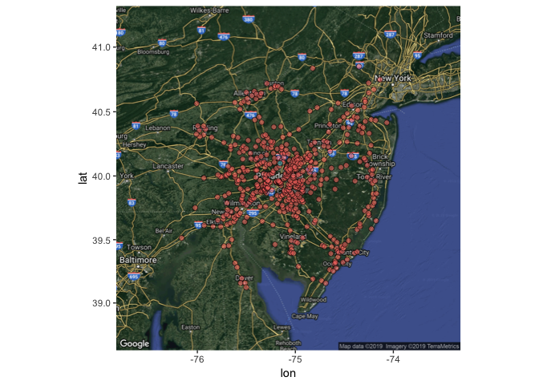
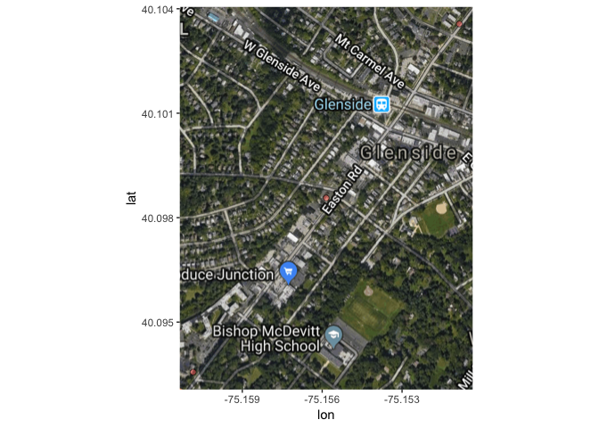
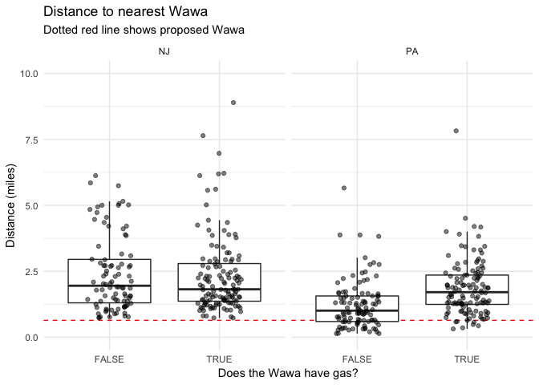
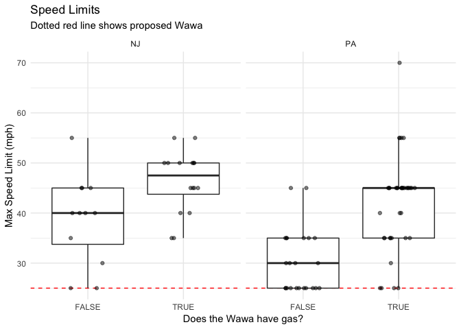

Is the new Wawa unusual?
================
Alice Walsh
6/15/2019

New Wawa in Glenside
====================

Motivation
----------

Goodman Properties is planning a Wawa with gas (“Super Wawa”) at the corner of Easton Road and Waverly Road in Glenside, PA.

Concerns from neighbors and the community were raised about safety, traffic, and the juxtaposition with smaller scale properties and businesses in the area.

There are also two other Wawa locations already in close proximity.

-   Are other Super Wawa locations in similar areas?
-   Are other Super Wawa locations this close to other Wawas?

``` r
# Load in data previously generated by '01_wawadata.R', '03_osmdata.R'
wawa_df <- readRDS('data/wawa_df.Rds')
osm_df <- readRDS('data/osm_df.Rds')

# Have col names lat state city in both
wawa_osm <- cbind(rename(wawa_df, lat_wawa = lat, lon_wawa = long, state_ab = state), 
                  rename(osm_df, osm_city = city))

wawa_osm$maxspeed_num <- as.numeric(gsub(" mph","",wawa_osm$maxspeed))
wawa_osm$lanes_num <- as.numeric(wawa_osm$lanes)
```

Step 1: Query data on Wawa locations in Northeast
-------------------------------------------------

Retrieved the Wawa locations from wawa.com for the area around Glenside, PA. *Retrieved data on 485 unique Wawa locations (PA, NJ, DE, MD).* Wawa.com data does not include detailed information on location size, number of pumps, etc.

-   470/485 Wawa locations are open 24 hours
-   280/485 Wawa locations have gas
-   280/485 Wawa locations have restrooms

Here is a map of all the locations in the dataset:

``` r
mapdf <- wawa_df[,c("long","lat")]
mapdf$new <- c(rep("exists",nrow(wawa_df)-1),"new")

# getting the map
mapgilbert <- get_map(location = c(lon = mean(mapdf$long), lat = mean(mapdf$lat)), zoom = 8,
                      maptype = "hybrid", scale = 2)
```

    ## Source : https://maps.googleapis.com/maps/api/staticmap?center=39.985222,-75.074544&zoom=8&size=640x640&scale=2&maptype=hybrid&language=en-EN&key=xxx

    ## Warning in strptime(x, fmt, tz = "GMT"): unknown timezone 'zone/tz/2019a.
    ## 1.0/zoneinfo/America/New_York'

``` r
# plotting the map with some points on it
ggmap(mapgilbert) +
  geom_point(data = mapdf, aes(x = long, y = lat, fill = new, alpha = 0.9), size = 2, shape = 21) +
  guides(fill=FALSE, alpha=FALSE, size=FALSE)
```



### Proposed new Wawa site

The proposed Wawa is at [200 S Easton Rd.](https://www.google.com/maps/place/200+S+Easton+Rd,+Glenside,+PA+19038/@40.0986321,-75.1580774,17z/data=!3m1!4b1!4m5!3m4!1s0x89c6ba0ab50e862d:0xda87770daaf8ea23!8m2!3d40.098628!4d-75.1558834)

``` r
# ZOOM in on new wawa
new_wawa <- data.frame(long = c(-75.155848, -75.155848-0.005, -75.155848+0.005),
                       lat = c(40.098564, 40.098564-0.005, 40.098564+0.005))
map_new <- get_map(location = c(lon = new_wawa$long[1], lat = new_wawa$lat[2]), zoom = 15,
                      maptype = "hybrid", scale = 2)
```

    ## Source : https://maps.googleapis.com/maps/api/staticmap?center=40.093564,-75.155848&zoom=15&size=640x640&scale=2&maptype=hybrid&language=en-EN&key=xxx

``` r
# plotting the map with some points on it
ggmap(map_new) +
  geom_point(data = new_wawa, aes(x = long, y = lat, fill = "red", alpha = 0.9), size = 2, shape = 21) +
  guides(fill=FALSE, alpha=FALSE, size=FALSE) + 
  scale_y_continuous(limits = c(40.098564-0.005, 40.098564+0.005)) +
  scale_x_continuous(limits = c(-75.155848-0.005, -75.155848+0.005)) +
  NULL
```

    ## Scale for 'y' is already present. Adding another scale for 'y', which
    ## will replace the existing scale.

    ## Scale for 'x' is already present. Adding another scale for 'x', which
    ## will replace the existing scale.

    ## Warning: Removed 1 rows containing missing values (geom_rect).



Step 2: Annotate Wawa locations with data from OpenStreetMaps
-------------------------------------------------------------

1.  Calculate the distance to the nearest Wawa for each location

2.  Retrieve number of lanes and max speed limit of road

-   May be misleading because nearest road might be a driveway or side road off of a major highway
-   Lanes and max speed limit are not available for most Wawa coordinates

1.  Count the number of houses, highways, and sidewalks in a set area around Wawa location

-   Not all buildings are on openstreetmaps - we need a better data source
-   Considered 'highway=motorways' as highways (<https://wiki.openstreetmap.org/wiki/Key:highway>)
-   Considered 'footway=sidewalk' as sidewalks

*These results could be sensitive to the area selected. Here I used a 0.01 degree latitude and longitude rectangle centered around the location. This is approximately a 0.69 x 0.53 mile rectangle. See above map for the area around the proposed Wawa as an example.*

Results: The new Wawa will be close to other Wawa locations
-----------------------------------------------------------

The distance to the nearest Wawa from each Wawa location was calculated in meters. The shortest distance between the Wawa coordinates was calculated according to the 'Vincenty (ellipsoid)' method as implemented in the 'geosphere' R package.

``` r
new_dist <- wawa_df$min_dist_wawa[wawa_df$storeName=="NEW"]
```

The closest Wawa to the proposed location will be 1028.0010513 meters from the nearest Wawa. That is 0.6387718 miles.

The median distance between locations is 2645.1198825 meters.

``` r
wawa_df %>% filter(state %in% c("NJ","PA")) %>% 
  ggplot(aes(x=fuel, y=min_dist_wawa/1609.34)) + 
  geom_hline(yintercept = new_dist/1609.34, color="red", linetype = 2) + 
  # geom_boxplot(outlier.shape = NA) + geom_jitter(height = 0, width = 0.2, alpha=0.5) + 
  ggbeeswarm::geom_quasirandom() + 
  facet_wrap(~state) +
  ylim(c(0,10)) +
  labs(title = "Distance to nearest Wawa", 
       subtitle = "Dotted red line shows proposed Wawa, split by NJ and PA",
       y="Distance (miles)", x="Does the Wawa have gas?")+
  theme_minimal()
```

    ## Warning: Removed 2 rows containing missing values (position_quasirandom).

    ## Warning: Removed 2 rows containing missing values (position_quasirandom).



Results: Most Wawa locations with gas are on higher speed roads
---------------------------------------------------------------

This is imperfect because the OpenStreetMap data was missing for some roads and the roads might be a driveway or service road off a larger (higher speed) road.

``` r
wawa_osm %>% filter(state_ab %in% c("NJ","PA"), !is.na(maxspeed_num)) %>% 
  ggplot(aes(y = maxspeed_num, x=fuel)) + 
  geom_hline(yintercept = 25, color="red", linetype = 2) + 
  # geom_boxplot(outlier.shape = NA) + 
  # geom_jitter(height = 0, width = 0.2, alpha=0.5) + 
  ggbeeswarm::geom_quasirandom() + 
  facet_wrap(~state_ab) +
  labs(title = "Speed Limits", 
       subtitle = "Dotted red line shows proposed Wawa, split by NJ and PA",
       y="Max Speed Limit (mph)", x="Does the Wawa have gas?")+
  theme_minimal()
```



Results: Most Wawa locations are in less residential/walkable areas
-------------------------------------------------------------------

Here, I use the number of sidewalks from OpenStreetMaps as a surrogate measure of the area's walkability. The proposed Wawa area has 25 marked sidewalks.

-   28/485 \[5.8%\] current Wawa locations have as many or more sidewalks than the proposed site
-   Of these 28, 13 have gas
-   Of these 28, 10 are in Philadelphia

``` r
with(wawa_df[wawa_df$storeName!="NEW",], table(fuel,sidewalk_count>=25, exclude = NULL))
```

    ##        
    ## fuel    FALSE TRUE
    ##   FALSE   190   15
    ##   TRUE    267   13

``` r
wawa_df[wawa_df$storeName!="NEW" & wawa_df$sidewalk_count>=25,] %>% count(city,sort=T)
```

    ## # A tibble: 17 x 2
    ##    city             n
    ##    <chr>        <int>
    ##  1 Philadelphia     5
    ##  2 PHILADELPHIA     5
    ##  3 Downingtown      2
    ##  4 Easton           2
    ##  5 Newark           2
    ##  6 ABINGTON         1
    ##  7 Absecon          1
    ##  8 Cherry Hill      1
    ##  9 Jenkintown       1
    ## 10 Kulpsville       1
    ## 11 Maple Shade      1
    ## 12 Media            1
    ## 13 NEWARK           1
    ## 14 READING          1
    ## 15 Warrington       1
    ## 16 Willow Grove     1
    ## 17 WYNCOTE          1
