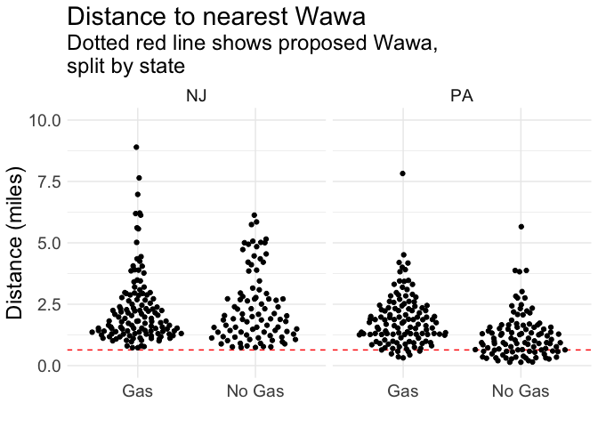
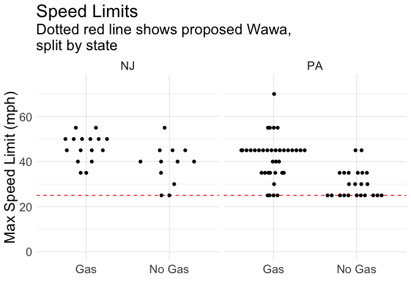

Is the new Wawa unusual?
================
Alice Walsh
6/15/2019

New Wawa in Glenside
====================

Motivation
----------

Goodman Properties is planning a Wawa with gas (“Super Wawa”) at the corner of Easton Road and Waverly Road in Glenside, PA. Read about it on the Cheltenham Township [website](https://cheltenhamtownship.org/pview.aspx?id=40801).

Concerns from neighbors and the community were raised about safety, traffic, and the juxtaposition with smaller scale properties and businesses in the area.

There are also two other Wawa locations already in close proximity.

-   Are other Super Wawa locations in similar areas?
-   Are other Super Wawa locations this close to other Wawas?

Step 1: Query data on Wawa locations in Northeast
-------------------------------------------------

Retrieved the Wawa locations from wawa.com for the area around Glenside, PA. *Retrieved data on 485 unique Wawa locations (PA, NJ, DE, MD).* Wawa.com data does not include detailed information on location size, number of pumps, etc.

-   470/485 Wawa locations are open 24 hours
-   280/485 Wawa locations have gas
-   280/485 Wawa locations have restrooms

Here is a map of all the locations in the dataset:

    ## Source : https://maps.googleapis.com/maps/api/staticmap?center=39.985222,-75.074544&zoom=8&size=640x640&scale=2&maptype=hybrid&language=en-EN&key=xxx

    ## Warning in strptime(x, fmt, tz = "GMT"): unknown timezone 'zone/tz/2019a.
    ## 1.0/zoneinfo/America/New_York'

### Proposed new Wawa site

The proposed Wawa is at [200 S Easton Rd.](https://www.google.com/maps/place/200+S+Easton+Rd,+Glenside,+PA+19038/@40.0986321,-75.1580774,17z/data=!3m1!4b1!4m5!3m4!1s0x89c6ba0ab50e862d:0xda87770daaf8ea23!8m2!3d40.098628!4d-75.1558834)

    ## Source : https://maps.googleapis.com/maps/api/staticmap?center=40.093564,-75.155848&zoom=15&size=640x640&scale=2&maptype=hybrid&language=en-EN&key=xxx

    ## Scale for 'y' is already present. Adding another scale for 'y', which
    ## will replace the existing scale.

    ## Scale for 'x' is already present. Adding another scale for 'x', which
    ## will replace the existing scale.

    ## Warning: Removed 1 rows containing missing values (geom_rect).

Step 2: Annotate Wawa locations with data from OpenStreetMaps
-------------------------------------------------------------

1.  Calculate the distance to the nearest Wawa for each location

2.  Retrieve number of lanes and max speed limit of road

-   May be misleading because nearest road might be a driveway or side road off of a major highway
-   Lanes and max speed limit are not available for most Wawa coordinates

1.  Count the number of houses, highways, and sidewalks in a set area around Wawa location

-   Not all buildings are on openstreetmaps - we need a better data source
-   Considered 'highway=motorways' as highways (<https://wiki.openstreetmap.org/wiki/Key:highway>)
-   Considered 'footway=sidewalk' as sidewalks

*These results could be sensitive to the size of the area selected. Here I used a 0.01 degree latitude and longitude rectangle centered around the location. This is approximately a 0.69 x 0.53 mile rectangle. See above map for the area around the proposed Wawa as an example.*

Results: The new Wawa will be unusually close to another Wawa location
----------------------------------------------------------------------

The distance to the nearest Wawa from each Wawa location was calculated in meters. The shortest distance between the Wawa coordinates was calculated according to the 'Vincenty (ellipsoid)' method as implemented in the 'geosphere' R package.

The closest Wawa to the proposed location will be 1028.0010513 meters from the nearest Wawa. That is 0.6387718 miles.

The median distance between locations is 2645.1198825 meters.

    ## Warning: Removed 2 rows containing missing values (position_quasirandom).

    ## Warning: Removed 2 rows containing missing values (position_quasirandom).

Results: Most Wawa locations with gas are on higher speed roads
---------------------------------------------------------------

This is imperfect because the OpenStreetMap data was missing for some roads and the roads might be a driveway or service road off a larger (higher speed) road.

From this data, I do see that locations with gas are on higher speed limit roads.

Results: Most Wawa locations are in less residential/walkable areas
-------------------------------------------------------------------

Here, I use the number of sidewalks from OpenStreetMaps as a surrogate measure of the area's walkability. The proposed Wawa area has **25** sidewalks.

-   28/485 \[5.8%\] current Wawa locations have as many or more sidewalks than the proposed site
-   Of these 28, 13 have gas
-   Of these 28, 10 are in Philadelphia

<!-- -->

    ##          
    ## gas_label FALSE TRUE
    ##    Gas      267   13
    ##    No Gas   190   15

    ## # A tibble: 17 x 2
    ##    city             n
    ##    <chr>        <int>
    ##  1 Philadelphia     5
    ##  2 PHILADELPHIA     5
    ##  3 Downingtown      2
    ##  4 Easton           2
    ##  5 Newark           2
    ##  6 ABINGTON         1
    ##  7 Absecon          1
    ##  8 Cherry Hill      1
    ##  9 Jenkintown       1
    ## 10 Kulpsville       1
    ## 11 Maple Shade      1
    ## 12 Media            1
    ## 13 NEWARK           1
    ## 14 READING          1
    ## 15 Warrington       1
    ## 16 Willow Grove     1
    ## 17 WYNCOTE          1

Comparable Wawa locations
=========================

So, these graphs and numbers are probably less interesting than just some comparisons to other Wawas. As a reminder, here is the new proposed Wawa [200 S Easton Rd.](https://www.google.com/maps/place/200+S+Easton+Rd,+Glenside,+PA+19038/@40.0986321,-75.1580774,17z/data=!3m1!4b1!4m5!3m4!1s0x89c6ba0ab50e862d:0xda87770daaf8ea23!8m2!3d40.098628!4d-75.1558834).

Here are links to some other nearby Wawa with gas on google maps:

-   [201 Old York Rd, Willow Grove, PA 19090](https://www.google.com/maps/place/Wawa/@40.1450747,-75.1157331,194m/data=!3m1!1e3!4m8!1m2!2m1!1swawa!3m4!1s0x0:0xd6bd9651899a5953!8m2!3d40.144994!4d-75.1152849)
-   [816 Old York Road Jenkintown, PA 19046](https://www.google.com/maps/place/816+Old+York+Rd,+Jenkintown,+PA+19046/@40.1058766,-75.125348,193m/data=!3m1!1e3!4m5!3m4!1s0x89c6b0f1f372a1e5:0x582c1d92a5c6ad88!8m2!3d40.1058805!4d-75.1249387)

Also owned by Goodman Properties:

-   [8250 Limekiln Pike, Cheltenham PA](https://www.google.com/maps/place/8250+Limekiln+Pike,+Wyncote,+PA+19095/@40.0789565,-75.1629177,603m/data=!3m2!1e3!4b1!4m5!3m4!1s0x89c6b9f8ac1f68f5:0x12e0cd63081082c1!8m2!3d40.079163!4d-75.1605576)
-   [2500 Philmont Ave. Huntingdon Valley, PA](https://www.google.com/maps/place/2500+Philmont+Ave,+Huntingdon+Valley,+PA+19006/@40.1206699,-75.0600542,603m/data=!3m1!1e3!4m5!3m4!1s0x89c6b2272c2ede9b:0x7da5ad695a44c7b9!8m2!3d40.1209592!4d-75.0587419)
-   [1111 Grosser Road, Gilbertsville PA](https://www.google.com/maps/place/1111+Grosser+Rd,+Gilbertsville,+PA+19525/@40.3111508,-75.6357423,601m/data=!3m2!1e3!4b1!4m5!3m4!1s0x89c681455daee945:0x644ba219b598cb44!8m2!3d40.3108523!4d-75.6337198)
